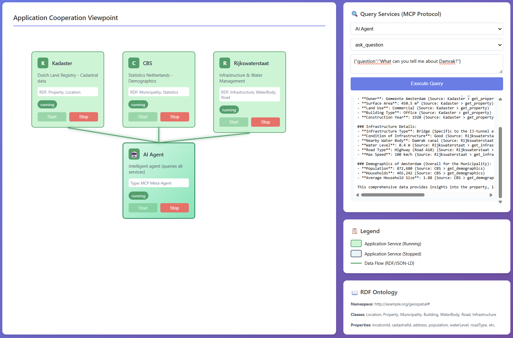

# Dutch Geospatial Data Integration - MCP Demo

> [!NOTE]
> This demo is made as part of the course "Architectures of Information Systems" 2025, taught by University of Twente. The architecture of this project (Archi model) is found at https://github.com/sbussemaker/2526-AIS-Group-9.

A demonstration project showcasing Enterprise Architecture Integration (EAI) using Dutch government data sources from three organizations:
- **Kadaster** (Dutch Land Registry) - Cadastral and property data via three key registers:
  - BAG (Basisregistratie Adressen en Gebouwen) - Building and address data
  - BGT (Basisregistratie Grootschalige Topografie) - Large-scale topography
  - BRT (Basisregistratie Topografie) - Topographic data
- **CBS** (Statistics Netherlands) - Demographic and statistical data
- **Rijkswaterstaat** (Ministry of Infrastructure) - Infrastructure and water management data

This demo illustrates how three independent government agencies can share complementary data about the same geographic locations through five MCP services using:
- **ArchiMate** for visual modeling
- **MCP (Model Context Protocol)** for service communication
- **RDF/JSON-LD** for semantic interoperability
- **Docker** for containerization
- **JSON-RPC** for remote procedure calls



## Quick start

To start the demo:

```console
cd client
python orchestrator.py
```

and

```console
cd dashboard
python -m http.server 8080
```

## Architecture Overview

```
┌──────────────────────────────────────────────────────────────────────────────────┐
│                        HTML Dashboard (ArchiMate View)                           │
│  ┌─────────────────────────────────────────┐                                     │
│  │              Kadaster                   │                                     │
│  │  ┌───────┐   ┌───────┐   ┌───────┐      │   ┌───────┐   ┌──────────────────┐  │
│  │  │  BAG  │   │  BGT  │   │  BRT  │      │   │  CBS  │   │ Rijkswaterstaat  │  │
│  │  │(Addr.)│   │(Topo) │   │(Topo) │      │   │(Stats)│   │ (Infrastructure) │  │
│  │  └───────┘   └───────┘   └───────┘      │   └───────┘   └──────────────────┘  │
│  └─────────────────────────────────────────┘        │               │            │
│        │             │            │                 │               │            │
│        └─────────────┴────────────┴─────────────────┴───────────────┘            │
│                                    │                                             │
│                              RDF Data Flows                                      │
└────────────────────────────────────┬─────────────────────────────────────────────┘
                                     │
                                     ↓
                            ┌────────────────┐
                            │   MCP Client   │
                            │  (Orchestrator)│
                            └────────────────┘
                                     │
        ┌──────────────┬─────────────┼─────────────┬──────────────┐
        ↓              ↓             ↓             ↓              ↓
┌─────────────┐ ┌─────────────┐ ┌─────────────┐ ┌─────────────┐ ┌──────────────────┐
│ MCP Server  │ │ MCP Server  │ │ MCP Server  │ │ MCP Server  │ │ MCP Server       │
│    (BAG)    │ │    (BGT)    │ │    (BRT)    │ │    (CBS)    │ │(Rijkswaterstaat) │
│ + RDF Store │ │ + RDF Store │ │ + RDF Store │ │ + RDF Store │ │  + RDF Store     │
└─────────────┘ └─────────────┘ └─────────────┘ └─────────────┘ └──────────────────┘
    Docker          Docker          Docker          Docker           Docker
  Container       Container       Container       Container        Container
```

## Shared Geospatial Ontology

All five services share a common RDF ontology (`ontology/geospatial.ttl`) with:

**Classes:**
- Location, Property, Municipality, Province
- Building, WaterBody, Road, Infrastructure

**Key Properties:**
- Identification: locationId, cadastralId, bagId
- Geographic: address, postalCode, coordinates (RD), latitude, longitude
- Kadaster: owner, surfaceArea, landUse, buildingType, constructionYear
- CBS: population, households, averageIncome, populationDensity, unemploymentRate
- Rijkswaterstaat: waterType, waterLevel, roadType, roadNumber, infrastructureType

## Sample Data

All five services contain data about the same three locations:

### LOC001 - Amsterdam (Damrak 1)
- **Kadaster**: Cadastral ID AMS01-G-1234, 450.5 m², owned by Gemeente Amsterdam, office building from 1920
- **CBS**: Population 872,680, 465,242 households, avg income €38,500
- **Rijkswaterstaat**: IJ-tunnel entrance (bridge), Damrak canal, A10 highway

### LOC002 - Utrecht (Oudegracht 231)
- **Kadaster**: Cadastral ID UTR02-K-5678, 320 m², owned by Universiteit Utrecht, university building from 1636
- **CBS**: Population 361,966, 183,149 households, avg income €35,200
- **Rijkswaterstaat**: Weerdsluis (lock), Oudegracht canal, A12 highway

### LOC003 - Rotterdam (Coolsingel 40)
- **Kadaster**: Cadastral ID RTD03-A-9012, 1200 m², owned by Gemeente Rotterdam, municipal building from 1914
- **CBS**: Population 651,446, 342,847 households, avg income €31,900
- **Rijkswaterstaat**: Erasmusbrug (bridge), Nieuwe Maas river, A15 highway

## 🤖 AI Agent

The system includes an **intelligent AI agent** powered by Azure OpenAI that can answer natural language questions by querying multiple MCP services.

**How it works:**
1. You ask a question in plain English
2. The agent determines which services to query
3. It gathers data from Kadaster, CBS, and/or Rijkswaterstaat
4. It synthesizes the information into a comprehensive answer

**Example questions:**
- "What is the population of Amsterdam?"
- "Compare the infrastructure in Utrecht and Rotterdam"
- "Tell me about the property and demographics in Amsterdam"
- "Which city has the highest population density?"

See [AGENTS.md](AGENTS.md) for detailed documentation.

## MCP Services

### 1. BAG Service (Addresses & Buildings)

**Purpose**: Official Dutch address and building registration data from Kadaster

**Tools:**
- `find_address`: Search by street name, city, or postal code
- `get_building`: Get building details (purpose, construction year, surface area)
- `get_address`: Get full address details by location ID
- `list_addresses`: List all registered addresses

**RDF Entities**: Address, Building

**Sample Query:**
```json
{
  "service": "bag-service",
  "tool": "get_building",
  "arguments": {"location_id": "LOC001"}
}
```

### 2. BGT Service (Large-Scale Topography)

**Purpose**: Large-scale topographic data (1:500-1:5000) including roads, water, and terrain from Kadaster

**Tools:**
- `find_area`: Search topographic features by name or type
- `get_terrain`: Get complete topographic info for a location
- `get_roads`: Get road infrastructure details
- `get_water`: Get water body information

**RDF Entities**: TopographicArea, Road, WaterBody

**Sample Query:**
```json
{
  "service": "bgt-service",
  "tool": "get_terrain",
  "arguments": {"location_id": "LOC001"}
}
```

### 3. BRT Service (Topographic Maps)

**Purpose**: Topographic map data (1:10,000+) including place names, boundaries, and landscape features from Kadaster

**Tools:**
- `find_place`: Search by place name, type, or location ID
- `get_boundaries`: Get administrative boundaries (municipality, province, water board)
- `get_place_names`: Get geographic names for a location
- `get_landscape`: Get landscape features (parks, forests)
- `list_municipalities`: List all municipalities

**RDF Entities**: GeographicName, AdministrativeBoundary, LandscapeFeature

**Sample Query:**
```json
{
  "service": "brt-service",
  "tool": "get_boundaries",
  "arguments": {"location_id": "LOC001"}
}
```

### 4. CBS Service (Statistics Netherlands)

**Purpose**: Demographic data and statistical information

**Tools:**
- `list_locations`: Get all locations with population data
- `get_statistics`: Get full statistical profile by location ID
- `get_demographics`: Get detailed demographic breakdown

**RDF Entities**: Municipality, Statistics

**Sample Query:**
```json
{
  "service": "cbs-service",
  "tool": "get_statistics",
  "arguments": {"location_id": "LOC001"}
}
```

### 5. Rijkswaterstaat Service (Infrastructure & Water Management)

**Purpose**: Infrastructure, roads, bridges, and water management data

**Tools:**
- `list_roads`: Get all managed road infrastructure
- `get_infrastructure`: Get complete infrastructure data by location ID
- `get_water_level`: Get current water level measurements

**RDF Entities**: Infrastructure, WaterBody, Road

**Sample Query:**
```json
{
  "service": "rijkswaterstaat-service",
  "tool": "get_infrastructure",
  "arguments": {"location_id": "LOC001"}
}
```

## Project Structure

```
ais/
├── ontology/
│   └── geospatial.ttl           # Shared RDF geospatial ontology
├── mcp-servers/
│   ├── Dockerfile.shared        # Shared distroless Docker image
│   ├── bag-service/
│   │   └── server.py            # BAG (Addresses & Buildings) MCP server
│   ├── bgt-service/
│   │   └── server.py            # BGT (Large-Scale Topography) MCP server
│   ├── brt-service/
│   │   └── server.py            # BRT (Topographic Maps) MCP server
│   ├── cbs-service/
│   │   └── server.py            # CBS MCP server
│   └── rijkswaterstaat-service/
│       └── server.py            # Rijkswaterstaat MCP server
├── client/
│   └── orchestrator.py          # Backend orchestrator (MCP client)
├── dashboard/
│   └── index.html               # ArchiMate visualization
└── docker-compose.yml
```

## Setup Instructions

### 1. Install Dependencies

```bash
# Install dependencies including the AI agent
uv sync
```

### 2. Configure Azure OpenAI (for AI Agent)

To enable the AI agent feature, configure your Azure OpenAI credentials in the `.env` file:

```bash
# Edit the .env file in the project root
AZURE_OPENAI_ENDPOINT=https://your-resource.openai.azure.com/
AZURE_OPENAI_API_KEY=your-api-key-here
AZURE_OPENAI_DEPLOYMENT_NAME=your-deployment-name
AZURE_OPENAI_API_VERSION=2024-12-01-preview
```

### 3. Start the Orchestrator

The orchestrator automatically builds Docker images on startup:

```bash
cd client
python orchestrator.py
```

The orchestrator will:
- Build all MCP server images (including agent service)
- Start FastAPI server on port 5000 (Swagger UI at `/docs`)
- Load Azure OpenAI credentials from `.env` file
- Enable logging to `/tmp/orchestrator.log`

### 4. Open the Dashboard

```bash
# Option 1: Direct file access
open dashboard/index.html

# Option 2: Using a web server
cd dashboard
python -m http.server 8080
```

Navigate to `http://localhost:8080`

### 5. Start Services

From the dashboard:
1. Click "Start" on each service box (BAG, BGT, BRT, CBS, Rijkswaterstaat)
2. Wait for services to show "running" status (green)
3. Connection lines will become active when all services are running

## Usage Examples

### Using the AI Agent

The easiest way to explore the data is using the AI agent:

**Via Dashboard:**
1. Find the "🤖 AI Agent" panel at the top right
2. Type your question
3. Click "Ask AI Agent"
4. Get a synthesized answer from multiple sources

**Via API:**
```bash
curl -X POST http://localhost:5000/api/agent/ask \
  -H "Content-Type: application/json" \
  -d '{"question": "What is the population of Utrecht?"}'
```

**Test script:**
```bash
python test_agent.py
```

### Cross-Agency Data Integration

Query all three agencies (via five services) for complementary data about the same location:

**1. Get building details from BAG (Kadaster):**
```json
Service: BAG
Tool: get_building
Arguments: {"location_id": "LOC002"}
```

**2. Get topographic data from BGT (Kadaster):**
```json
Service: BGT
Tool: get_terrain
Arguments: {"location_id": "LOC002"}
```

**3. Get administrative boundaries from BRT (Kadaster):**
```json
Service: BRT
Tool: get_boundaries
Arguments: {"location_id": "LOC002"}
```

**4. Get demographic statistics from CBS:**
```json
Service: CBS
Tool: get_statistics
Arguments: {"location_id": "LOC002"}
```

**5. Get infrastructure details from Rijkswaterstaat:**
```json
Service: Rijkswaterstaat
Tool: get_infrastructure
Arguments: {"location_id": "LOC002"}
```

Now you have a complete picture of Utrecht (Oudegracht 231):
- **Building**: Education building, 3200 m², built 1636
- **Topography**: Urban center with brick surface, Oudegracht canal nearby
- **Administrative**: Utrecht municipality, De Stichtse Rijnlanden water board
- **Demographics**: City of 361,966 people with avg income €35,200
- **Infrastructure**: Weerdsluis lock, Oudegracht canal, A12 highway access

### Listing All Data

Get overview from each service:

```json
// BAG - All addresses
{"service": "bag-service", "tool": "list_addresses", "arguments": {}}

// BRT - All municipalities
{"service": "brt-service", "tool": "list_municipalities", "arguments": {}}

// CBS - All locations
{"service": "cbs-service", "tool": "list_locations", "arguments": {}}

// Rijkswaterstaat - All roads
{"service": "rijkswaterstaat-service", "tool": "list_roads", "arguments": {}}
```

## Technical Details

### Semantic Interoperability via RDF

All five services use the shared geospatial ontology, ensuring:
- **Common vocabulary**: Same property names across services
- **Linked data**: All services reference the same location IDs
- **JSON-LD format**: Standard RDF serialization for easy parsing
- **Namespace**: `http://example.org/geospatial#`

### MCP Protocol Communication

- JSON-RPC 2.0 transport over stdio
- Docker socket communication with multiplexing header handling
- Automatic error recovery and UTF-8 encoding
- See [TROUBLESHOOTING.md](TROUBLESHOOTING.md) for technical details

### Docker Integration

All five MCP services (BAG, BGT, BRT, CBS, Rijkswaterstaat) share a distroless Docker image for enhanced security and reduced size:
- **Distroless base**: Using `gcr.io/distroless/python3-debian12` (no shell, minimal attack surface)
- **Image size**: 91.4MB (48% smaller than standard python:3.14-slim at 177MB)
- **Multi-stage build**: Dependencies installed in builder stage, copied to minimal runtime
- **Shared Dockerfile**: `/mcp-servers/Dockerfile.shared` used by all five services

Each service runs in isolation with:
- No exposed ports (stdio communication only)
- Independent lifecycle management
- Automatic rebuild on orchestrator startup
- Container status monitoring

## ArchiMate Modeling

This demo illustrates:

- **Application Services**: BAG, BGT, BRT (Kadaster), CBS, Rijkswaterstaat
- **Data Objects**: Location (RDF), Address (RDF), Building (RDF), Infrastructure (RDF)
- **Flow Relationships**: Geospatial data flows via RDF/JSON-LD
- **Application Cooperation**: Five services from three organizations providing complementary views of the same entities
- **Technology Layer**: Docker, MCP, HTTP/JSON-RPC

## Real-World Relevance

This architecture mirrors actual Dutch government data integration challenges:

1. **Data Sovereignty**: Each agency maintains its own data and systems
2. **Semantic Standards**: Shared ontologies enable interoperability
3. **Distributed Architecture**: Services are independent but interconnected
4. **Multi-source Queries**: Applications can aggregate data from multiple authoritative sources
5. **Real Dutch Agencies**: Kadaster, CBS, and Rijkswaterstaat are real government organizations

### Actual Dutch Data Standards

The Netherlands uses key registers (basisregistraties), including:
- **BAG (Basisregistratie Adressen en Gebouwen)**: Building and address registry
- **BGT (Basisregistratie Grootschalige Topografie)**: Large-scale topographic data
- **BRT (Basisregistratie Topografie)**: Topographic map data
- **BRK (Basisregistratie Kadaster)**: Cadastral registry
- **RD coordinates**: Rijksdriehoekscoördinaten coordinate system
- **Linked Data**: Many Dutch government datasets are available as RDF

## Debugging with MCP Inspector

The [MCP Inspector](https://modelcontextprotocol.io/docs/tools/inspector) provides an interactive UI for testing and debugging MCP servers.

```bash
# Inspect any service locally
./scripts/inspect-mcp.sh bag-service
./scripts/inspect-mcp.sh bgt-service
./scripts/inspect-mcp.sh brt-service
./scripts/inspect-mcp.sh cbs-service
./scripts/inspect-mcp.sh rijkswaterstaat-service

# Inspect via Docker (container must be running)
./scripts/inspect-mcp.sh bag-service --docker

# Inspect agent-service (requires .env with Azure credentials)
./scripts/inspect-mcp.sh agent-service
```

The Inspector opens a web UI at `http://localhost:5173` where you can:
- Browse available tools and their JSON schemas
- Execute tools with custom arguments
- View server logs and notifications in real-time

## API Endpoints

### Orchestrator REST API

- **GET /api/services**: List all services and their statuses
- **POST /api/services/:name/start**: Start a service container
- **POST /api/services/:name/stop**: Stop a service container
- **POST /api/query**: Execute MCP queries across services
- **POST /api/agent/ask**: Ask the AI agent a natural language question
- **GET /api/ontology**: Get the geospatial ontology in Turtle format

## Extending the Demo

### Adding Real Data Sources

Replace mock data with actual APIs:
- Connect to real Kadaster BRK API
- Integrate CBS StatLine data
- Use Rijkswaterstaat NDW (National Data Warehouse)

### Adding More Agencies

Easily add more Dutch government services:
- **RVO** (Netherlands Enterprise Agency) - Business data
- **KNMI** (Royal Netherlands Meteorological Institute) - Weather data
- **Waterschappen** (Water boards) - Local water management

### Expanding the Ontology

Add more geospatial concepts:
- Environmental data
- Traffic flows
- Land use planning
- Cultural heritage sites

## References

- [Kadaster](https://www.kadaster.nl/) - Dutch Land Registry
- [CBS](https://www.cbs.nl/) - Statistics Netherlands
- [Rijkswaterstaat](https://www.rijkswaterstaat.nl/) - Ministry of Infrastructure
- [Model Context Protocol (MCP)](https://modelcontextprotocol.io/)
- [ArchiMate](https://www.opengroup.org/archimate-forum)
- [RDF/JSON-LD](https://json-ld.org/)
